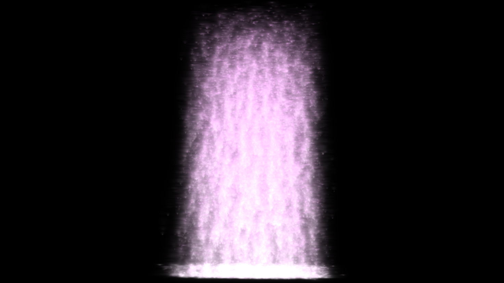
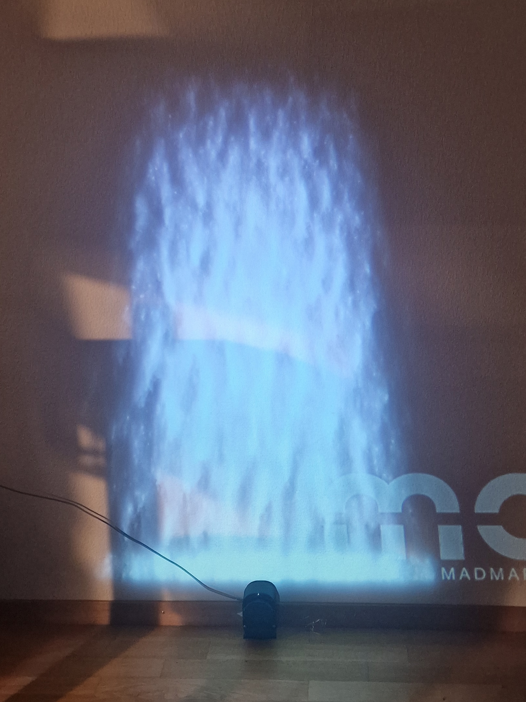
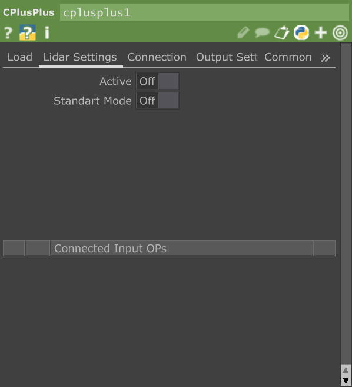
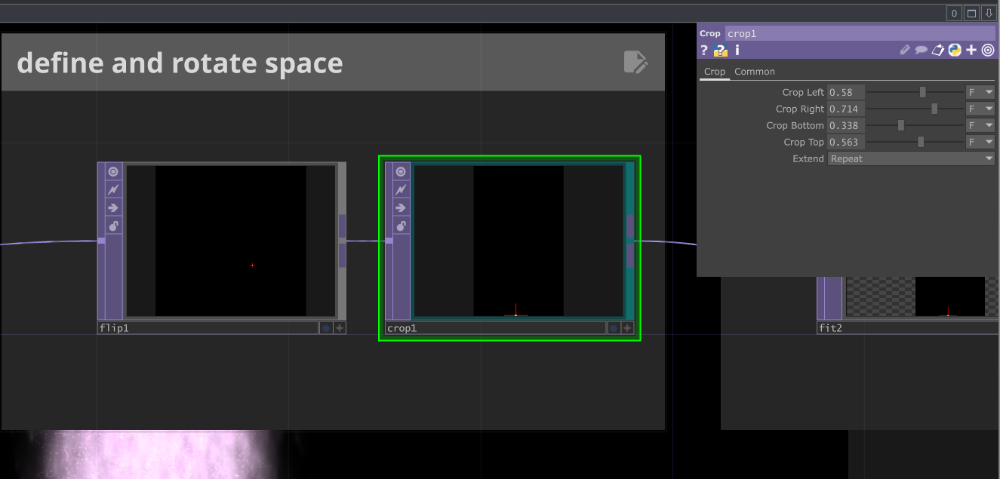
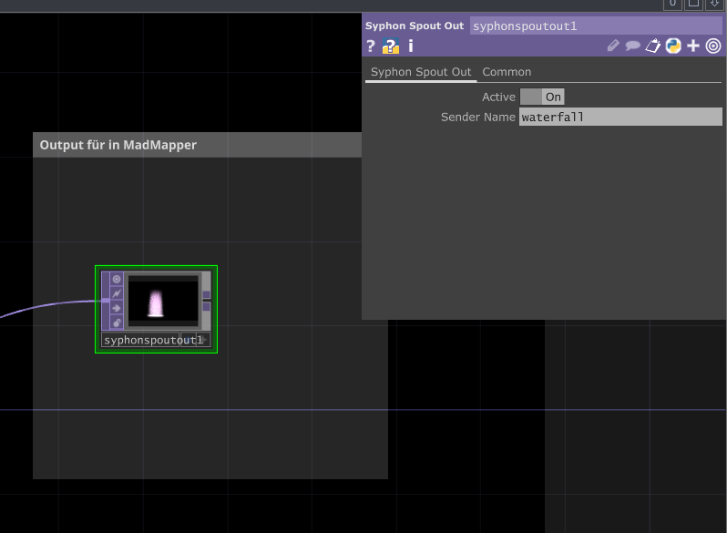
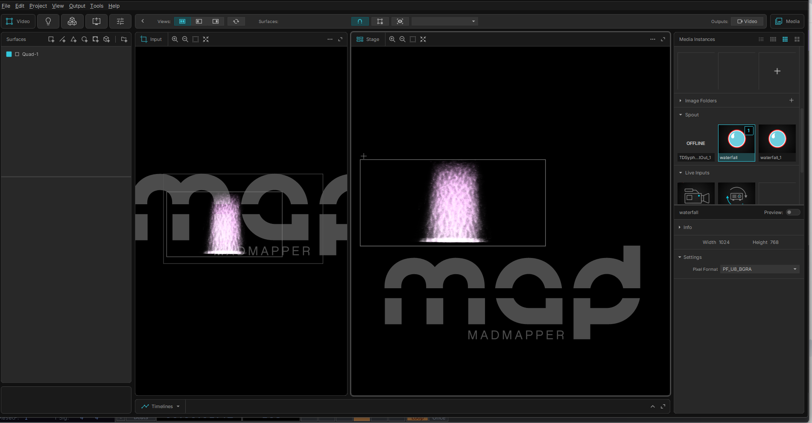
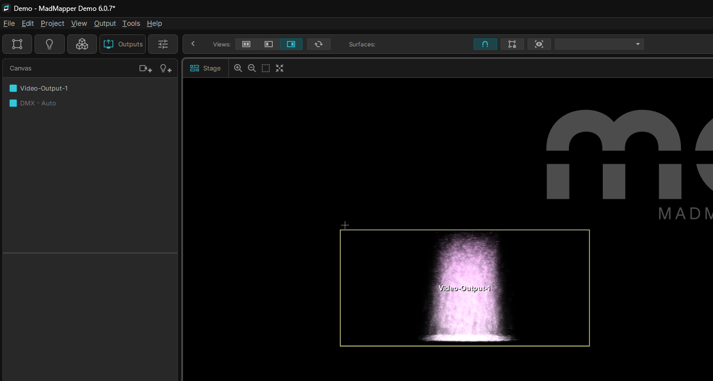

# INTERAKTIVER WASSERFALL
Ein Projekt von Nadia Giliberti

## ÜBERBLICK
In diesem Projekt wurde in TouchDesigner ein interaktiver Wasserfall mit Particles umgesetzt. Das Bild des Wasserfalls wird mit einem Projektor an eine Wand projiziert und kann durch Interaktion mit der Wand beeinflusst werden.
Ein Slamtec RP Lidar A1 (in meinem Projekt am Boden montiert) erfasst die Bewegung von Personen vor der Projektion. Diese Daten werden in TouchDesigner verarbeitet und wirken sich direkt auf den Wasserfall aus. Die Interaktion funktioniert dabei ähnlich, als wäre die Wand ein Touchscreen.
Die visuelle Ausgabe wird in Kopplung mit MadMapper (Demo-Version) für die Projektion eingerichtet.
So entsteht ein direktes interaktives Erlebnis zwischen Person und Projektion.

### VIDEOS:
**Insights Projektaufbau**:

**Demovideo Installation**:

## PROJEKT REPRODUZIEREN
### VERWENDETE RESSOURCEN:
- Touchdesigner 2025.32050
- MadMapperDemo 5.7.1
- Slamtec RP Lidar A1
- Projektor, jeglicher Art

### INSTALLATION VORGEHEN
1. Dateien "wasserfall_lidartrack.toe" und "SlamtecCHOP_V3.dll" aus Github-Projekt herunterladen und in Ordner der Wahl platzieren.  
Wichtig: beide Dateien in gleicher Ordnerebene belassen.
2. "wasserfall_lidartrack.toe" in Touchdesigner öffnen
3. Lidartrack an Gerät anschliessen
4. Geräte-Manager (auf dem Computer) öffnen und schauen welchen COM Port für den Lidartrack verwendet wird.  
Problembehebung: Wenn Lidartrack unter den Geräten nicht erkannt wird. Treiber auf der offiziellen Website herunterladen:  
[https://www.silabs.com/software-and-tools/usb-to-uart-bridge-vcp-drivers?tab=downloads](https://www.silabs.com/software-and-tools/usb-to-uart-bridge-vcp-drivers?tab=downloads)
5. Im Projekt cplusplus1 anwählen und im Register "Connection Settings" den soeben ermittelten Port bei "COM Port" eingeben.  

6. Register "Lidar Settings" öffnen und Active von Off auf On setzen.  

7. Daten sollten nun vom Lidar erfasst werden und den Wasserfall beeinflussen
8. Im Operator crop1 die Werte so einstellen, dass der Interaktionsbereich des Lidar-Sensors dem projizierten Bereich entspricht.

9. In der Touchdesigner-Datei ganz zu hinterst: Syphon Spout Out auf Active setzen.

10. MadMapper öffnen
11. Projektor mit Computer verbinden
12. Ganz rechts bei Media -> Mediainstances -> Spout -> Spout "waterfall" anwählen.
 

13. Das Feld "Outputs" anklicken.

14. Mit Ctrl + U die Projektion starten. Mit Ctrl + T die Projektion beenden.

#### Das Projekt sollte nun funktionieren. 

### KOMPONENTEN DIAGRAMM
- kommt noch

### REFLEXION
- Planung und Umsetzung
- Herausforderungen: Beamer kabel kaputt - Bern vs. Chur - PC alternative für lidar - kabel Lidar kurz
- Aufgabenverteilung - me myself and i
- Lernerfolg: komplett neue Programme. Vorher noch nie was mit Touchdesigner/Madmapper was gemacht.
- verwendete Tools: KI nur wenig. teilweise mit Claude oder Chatgpt problembehebungen versucht. Coachings mit Dozenten. Tutorials auf Youtube
- bekannte Bugs: 
