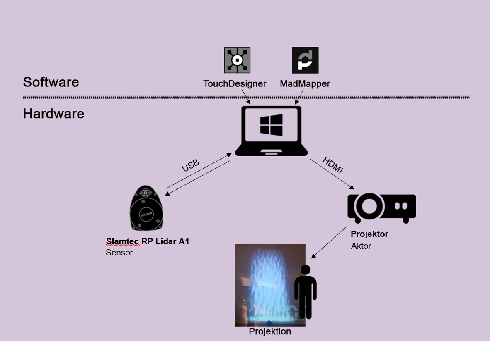

# INTERAKTIVER WASSERFALL
Ein Projekt von Nadia Giliberti

## ÜBERBLICK
In diesem Projekt wurde in TouchDesigner ein interaktiver Wasserfall mit Particles umgesetzt. Das Bild des Wasserfalls wird mit einem Projektor an eine Wand projiziert und kann durch Interaktion mit der Wand beeinflusst werden.
Ein Slamtec RP Lidar A1 (in meinem Projekt am Boden montiert) erfasst die Bewegung von Personen vor der Projektion. Diese Daten werden in TouchDesigner verarbeitet und wirken sich direkt auf den Wasserfall aus. Die Interaktion funktioniert dabei ähnlich, als wäre die Wand ein Touchscreen.
Die visuelle Ausgabe wird in Kopplung mit MadMapper (Demo-Version) für die Projektion eingerichtet.
So entsteht ein direktes interaktives Erlebnis zwischen Person und Projektion.

### VIDEOS:
**Insights Projektaufbau**:

**Demovideo Installation**:

## PROJEKT REPRODUZIEREN
### VERWENDETE RESSOURCEN:
- Touchdesigner 2025.32050
- MadMapperDemo 5.7.1
- Slamtec RP Lidar A1
- Projektor, jeglicher Art

### INSTALLATION VORGEHEN
1. Dateien "wasserfall_lidartrack.toe" und "SlamtecCHOP_V3.dll" aus Github-Projekt herunterladen und in Ordner der Wahl platzieren.  
Wichtig: beide Dateien in gleicher Ordnerebene belassen.
2. "wasserfall_lidartrack.toe" in Touchdesigner öffnen
3. Lidartrack an Gerät anschliessen
4. Geräte-Manager (auf dem Computer) öffnen und schauen welchen COM Port für den Lidartrack verwendet wird.  
Problembehebung: Wenn Lidartrack unter den Geräten nicht erkannt wird. Treiber auf der offiziellen Website herunterladen:  
[https://www.silabs.com/software-and-tools/usb-to-uart-bridge-vcp-drivers?tab=downloads](https://www.silabs.com/software-and-tools/usb-to-uart-bridge-vcp-drivers?tab=downloads)
5. Im Projekt cplusplus1 anwählen und im Register "Connection Settings" den soeben ermittelten Port bei "COM Port" eingeben.  

6. Register "Lidar Settings" öffnen und Active von Off auf On setzen.  

7. Daten sollten nun vom Lidar erfasst werden und den Wasserfall beeinflussen
8. Im Operator crop1 die Werte so einstellen, dass der Interaktionsbereich des Lidar-Sensors dem projizierten Bereich entspricht.

9. In der Touchdesigner-Datei ganz zu hinterst: Syphon Spout Out auf Active setzen.

10. MadMapper öffnen
11. Projektor mit Computer verbinden
12. Ganz rechts bei Media -> Mediainstances -> Spout -> Spout "waterfall" anwählen.
 

13. Das Feld "Outputs" anklicken.

14. Mit Ctrl + U die Projektion starten. Das Projekt sollte nun funktionieren. 
15. Mit Ctrl + T die Projektion beenden.

### KOMPONENTEN DIAGRAMM

### REFLEXION
#### Planung und Umsetzung
Die Idee für mein Projekt entstand relativ schnell. Nachdem ich mich zunächst in die Grundlagen und Funktionen von TouchDesigner eingearbeitet hatte, entschied ich mich dazu, mithilfe von Tutorials ein Partikelsystem zu erstellen. Da mein persönlicher Computer über keine Grafikkarte verfügt, verzichtete ich bewusst auf physikbasierte Simulationen (Physics), auch wenn diese für die Darstellung eines realistischen Wasserfalls sicher vorteilhaft gewesen wären. Stattdessen konzentrierte ich mich auf eine ressourcenschonendere Umsetzung.

Diese Strategie zahlte sich aus: Bereits an Tag 4 des Moduls hatte ich einen soliden, funktionierenden Wasserfall erstellt, den ich mit den Dozierenden besprechen konnte. Für die Interaktivität war die Einbindung eines LiDAR-Sensors geplant. Hierbei war mir Jan eine grosse Hilfe, der mir nicht nur den Sensor zur Verfügung stellte, sondern auch gleich eine funktionierende TouchDesigner-Datei lieferte, in der der LiDAR bereits Daten erheben konnte. Meine Aufgabe bestand anschliessend darin, diese Vorlage zu verstehen und an meine spezifischen Bedürfnisse anzupassen.

Zwar kam das fertige Produkt im Rahmen dieses Moduls noch nicht bei einer öffentlichen Veranstaltung zum Einsatz, mir war jedoch wichtig, dass das Konzept das Potenzial hierfür mitbringt. Besonders für professionelle Installationen im Bereich immersiver Erlebnisse wäre diese Anwendung gut geeignet. 

#### Herausforderungen
Trotz des schnellen Starts sah ich mich im Verlauf des Projekts mit einigen technischen und logistischen Hürden konfrontiert. Das Hauptproblem blieb die fehlende Grafikkarte meines Laptops: Die Daten des LiDAR-Sensors konnten auf meinem eigenen Gerät schlichtweg nicht empfangen werden. Ich musste daher auf einen fest installierten PC mit Grafikkarte ausweichen.

Als ich auf den stationären PC wechselte, stellte sich zudem heraus, dass das Verbindungskabel des LiDAR-Sensors mit ca. 50 cm sehr kurz war. Auch die HDMI- und Stromkabel des Beamers waren begrenzt. Das führte dazu, dass ich den Beamer nicht weit genug von der Projektionswand entfernt aufstellen konnte. Die Konsequenz war, dass der Wasserfall deutlich kleiner projiziert wurde als ursprünglich beabsichtigt (wie auch im „Behind the Scenes“-Video ersichtlich). Mit hochwertigerem Equipment und längeren Kabeln wäre das Setup jedoch problemlos skalierbar und auch für professionelle Grossinstallationen geeignet.

#### Aufgabenverteilung
Da ich dieses Projekt als Einzelarbeit umgesetzt habe, lag die gesamte Verantwortung für Konzeption und Ausführung bei mir selbst.

#### Lernerfolg: 
Ein grosser persönlicher Erfolg war die Einarbeitung in komplett neue Software-Umgebungen. Vor diesem Modul hatte ich noch keinerlei Berührungspunkte mit TouchDesigner oder MadMapper. Ich konnte mir in kurzer Zeit Grundkenntnisse aneignen und diese direkt praktisch anwenden.

#### verwendete Tools
Künstliche Intelligenz (wie Claude oder ChatGPT) habe ich nur wenig genutzt. Ich habe zwar versucht, damit Probleme zu lösen, musste aber feststellen, dass sie bei TouchDesigner leider keine Hilfe waren. Meinen Lernprozess stützte ich daher hauptsächlich auf YouTube-Tutorials sowie die Coachings mit den Dozenten.

#### bekannte Bugs 
Softwareseitig sind mir aktuell keine Bugs bekannt, jedoch gibt es Einschränkungen in der Darstellung meines fertigen Produktes. Wie unter „Herausforderungen“ erwähnt, ist die Projektion aufgrund der begrenzten Kabellängen kleiner als gewünscht. Wäre natürlich schön gewesen, wenn der Wasserfall mehrere Meter hoch gewesen wäre. Zudem wird das Bild durch den verwendeten Projektor eher bläulich statt des beabsichtigten Violett-Tons dargestellt.
